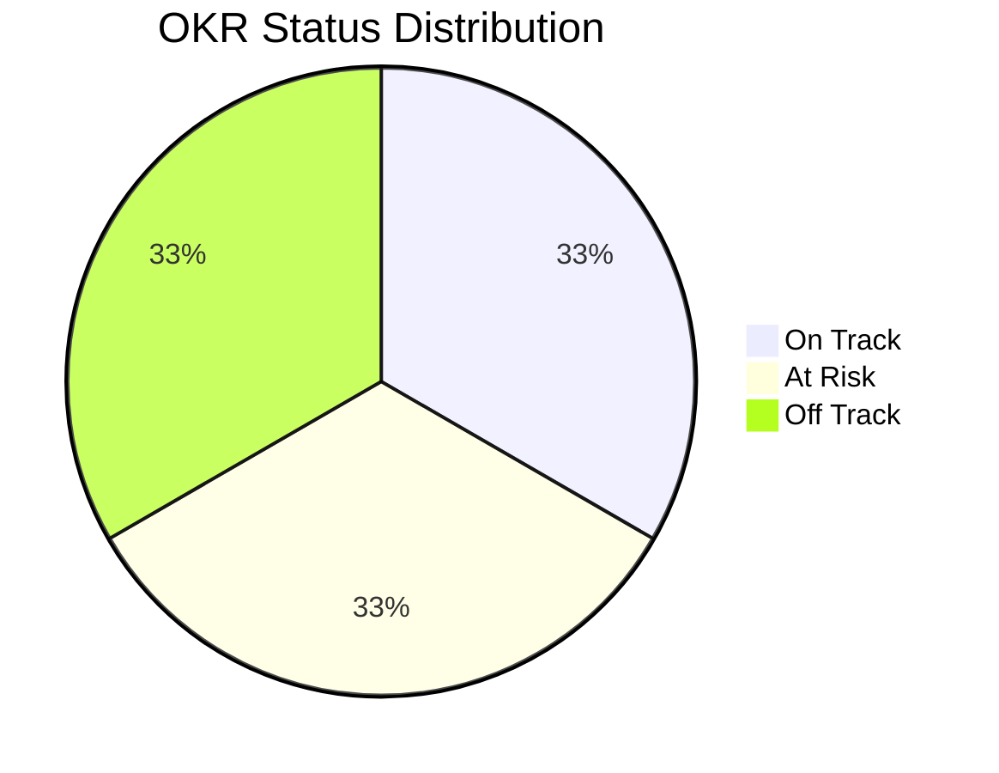
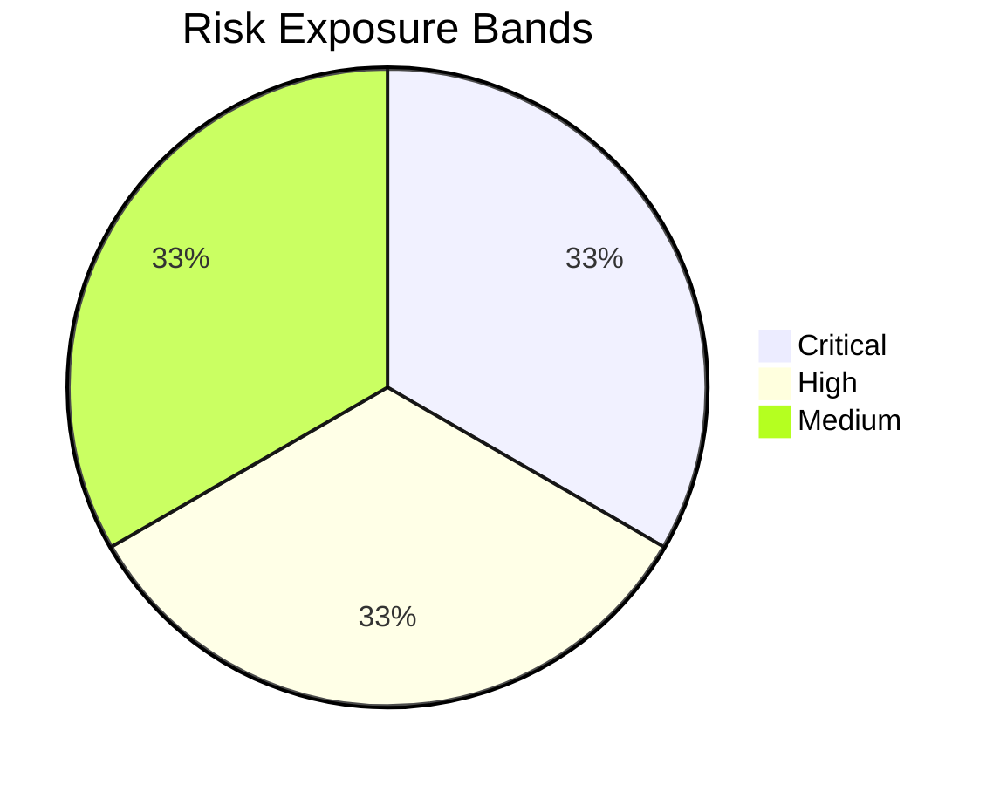

# Developer Platform OKR Update - 2026-05-22

**Source of truth:** https://coda.io/d/Developer-Platform-Mission_dLGZ7ZRwER_/2026-Developer-Platforms-OKRs-Initiatives_suSYCzE2#_lusqZqZ0

## Executive Summary
- **Period:** H1 2026
- **Overall OKR Progress:** 48.0%
- **At-risk signal:** 1 off-track OKR(s), 1 critical risk(s)
- **Report prepared by:** Program Manager

## KPI Snapshot

| Metric | Value |
|---|---:|
| Total OKRs | 3 |
| Total Initiatives | 3 |
| Total Risks | 3 |
| Avg OKR Progress | 48.0% |
| Avg Initiative Progress | 45.7% |

### Changes Since Last Update

| Metric | Previous | Current | Delta |
|---|---:|---:|---:|
| Total OKRs | 3 | 3 | +0 |
| Total Initiatives | 4 | 3 | -1 |
| Total Risks | 3 | 3 | +0 |

## OKR Health

| OKR | Owner | Status | Progress | Confidence |
|---|---|---|---:|---:|
| Improve platform developer productivity | DevEx | on track | 62.0% | 4 |
| Increase CI reliability and speed | Platform Infra | at risk | 48.0% | 3 |
| Strengthen platform security posture | Security Platform | off track | 34.0% | 2 |

## Initiative Callouts (At Risk / Off Track)

| Initiative | OKR | Owner | Status | Progress | Next Milestone |
|---|---|---|---|---:|---|
| Flaky test reduction program | OKR-2 | QA Platform | at risk | 42.0% | Top 20 flaky suites remediated |
| Runtime dependency hardening | OKR-3 | Security Platform | off track | 25.0% | SBOM policy enforcement in CI |

## Risk Profile

| Risk | Owner | Severity | Likelihood | Score | Band | Status | Mitigation |
|---|---|---:|---:|---:|---|---|---|
| Security remediation backlog exceeds capacity | Security Platform | 5 | 4 | 20 | critical | open | Reallocate 2 engineers from infra migration for 1 cycle. |
| CI queue times increase with monorepo growth | Platform Infra | 4 | 3 | 12 | high | open | Introduce dynamic executor scaling and test sharding. |
| Service teams delay adoption of new golden paths | DevEx | 3 | 3 | 9 | medium | monitoring | Expand onboarding office hours and adoption playbooks. |

## Decisions Required

| Type | Topic | Owner | Decision Needed | Due |
|---|---|---|---|---|
| risk | Security remediation backlog exceeds capacity | Security Platform | Approve temporary staffing rebalance. | 2026-04-12 |
| initiative | Flaky test reduction program | QA Platform | Approve temporary freeze on non-critical test additions for 2 sprints. | 2026-04-15 |
| initiative | Runtime dependency hardening | Security Platform | Decide on mandatory dependency pinning policy scope for all services. | 2026-04-18 |

## Major Callouts

### Wins
- Improve platform developer productivity improved by 10.0 pts (52.0% -> 62.0%).

### Issues
- Critical risk: Security remediation backlog exceeds capacity (score=20).
- Strengthen platform security posture is off track.

### Major Changes
- New initiative added: Flaky test reduction program
- New initiative added: Runtime dependency hardening
- New initiative added: Self-service environment bootstrap
- OKR status changed: Improve platform developer productivity (at_risk -> on_track).
- OKR status changed: Increase CI reliability and speed (on_track -> at_risk).
- OKR status changed: Strengthen platform security posture (at_risk -> off_track).

## Notes
- This report is auto-generated from the Coda snapshot for this cycle.
- Program Manager should review and adjust narrative before sending to CTO.
